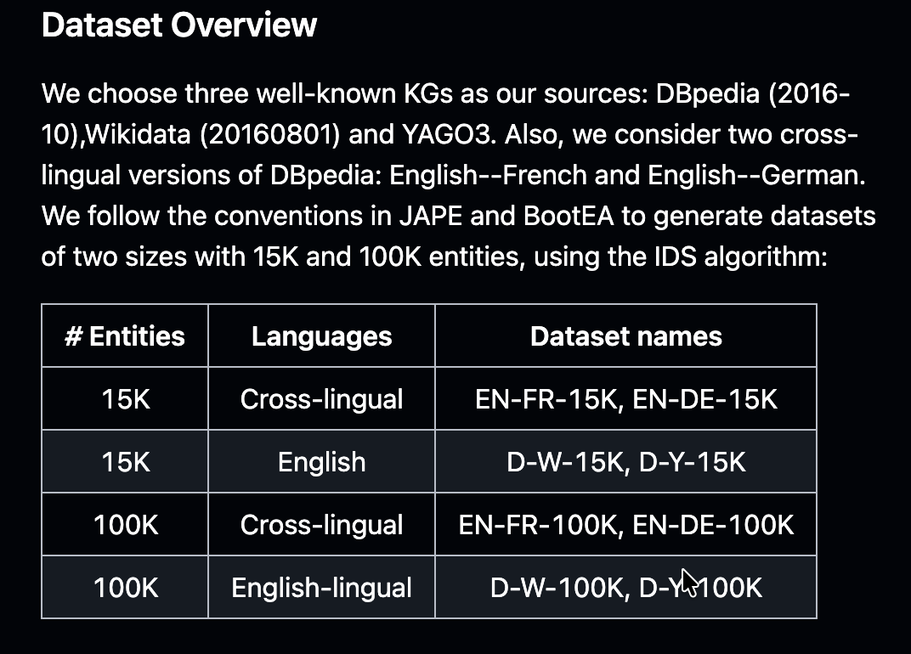

# Concept-Aware Entity Alignment Network for Industrial Knowledge Graph




---

# D-W-15K Dataset Structure

CAEA performs **entity alignment between two Knowledge Graphs (KGs)**.

For the **D-W-15K** dataset:

| KG      | Source   |        ID Range | Purpose                |
| ------- | -------- | --------------: | ---------------------- |
| **KG1** | DBpedia  |     `0 – 14999` | First knowledge graph  |
| **KG2** | Wikidata | `15000 – 29999` | Second knowledge graph |

The suffix `_1` refers to **KG1 (DBpedia)**, while `_2` refers to **KG2 (Wikidata)**.

> **Important:** `_1` and `_2` do **not** mean training/testing. They identify the two different knowledge graphs.

---

## Dataset Files

| File          | KG        | Contents                             | Format                     |
| ------------- | --------- | ------------------------------------ | -------------------------- |
| `ent_ids_1`   | KG1       | Entity ID → Entity URI               | `ID URI`                   |
| `ent_ids_2`   | KG2       | Entity ID → Entity URI               | `ID URI`                   |
| `rel_ids_1`   | KG1       | Relation ID → Relation URI           | `ID URI`                   |
| `rel_ids_2`   | KG2       | Relation ID → Relation URI           | `ID URI`                   |
| `attr_ids_1`  | KG1       | Attribute ID → Attribute URI         | `ID URI`                   |
| `attr_ids_2`  | KG2       | Attribute ID → Attribute URI         | `ID URI`                   |
| `triples_1`   | KG1       | Relation triples                     | `Head Relation Tail`       |
| `triples_2`   | KG2       | Relation triples                     | `Head Relation Tail`       |
| `ent_attr_1`  | KG1       | Entity-attribute-literal information | `Entity Attribute Literal` |
| `ent_attr_2`  | KG2       | Entity-attribute-literal information | `Entity Attribute Literal` |
| `ref_ent_ids` | KG1 ↔ KG2 | Ground-truth entity alignments       | `KG1_ID KG2_ID`            |

---

# 1. Entity Files

### `ent_ids_1`

Contains the mapping from **KG1 entity IDs to DBpedia entity URIs**.

```text
0  http://dbpedia.org/resource/Rati_Agnihotri
1  http://dbpedia.org/resource/Filmworks_IX:_Trembling_Before_G-d
2  http://dbpedia.org/resource/Midnight_Zoo_(album)
```

|  ID | Entity                               |
| --: | ------------------------------------ |
| `0` | `Rati_Agnihotri`                     |
| `1` | `Filmworks IX: Trembling Before G-d` |
| `2` | `Midnight Zoo (album)`               |

---

### `ent_ids_2`

Contains the mapping from **KG2 entity IDs to Wikidata entity URIs**.

```text
15000  http://www.wikidata.org/entity/Q1125300
15001  http://www.wikidata.org/entity/Q5680934
15002  http://www.wikidata.org/entity/Q7749652
```

|      ID | Entity     |
| ------: | ---------- |
| `15000` | `Q1125300` |
| `15001` | `Q5680934` |
| `15002` | `Q7749652` |

### Why do KG2 IDs start at `15000`?

The two KGs use a **combined entity ID space**:

```text
0 ───────────────── 14999 | 15000 ───────────────── 29999
          KG1             |             KG2
        DBpedia           |           Wikidata
```

This allows the model to maintain a single entity embedding table without ID collisions.

---

# 2. Relation Files

Relations describe **connections between two entities**.

General form:

```text
Entity → Relation → Entity
```

For example:

```text
The Green Room → starring → Nathalie Baye
```

### `rel_ids_1`

Maps relation IDs to DBpedia relations.

Example:

```text
113  http://dbpedia.org/ontology/starring
```

Therefore:

```text
113 = starring
```

### `rel_ids_2`

Maps relation IDs to Wikidata relations.

The relation vocabularies of KG1 and KG2 are independent because the two KGs can represent the same semantic relationship using different relation names.

For example:

```text
KG1: starring
KG2: cast member
```

Therefore, the model cannot simply compare relation IDs; it must learn representations from their semantic and structural context.

---

# 3. Relation Triple Files

### `triples_1`

Contains the graph structure of **KG1**.

Format:

```text
Head_ID  Relation_ID  Tail_ID
```

Example:

```text
5841  113  1728
```

Using the ID dictionaries:

```text
5841 → The Green Room (film)
113  → starring
1728 → Nathalie Baye
```

Therefore:

```text
The Green Room (film)
        │
     starring
        │
        ▼
   Nathalie Baye
```

---

### `triples_2`

Contains the graph structure of **KG2**.

It follows the same format:

```text
Head_ID  Relation_ID  Tail_ID
```

but all IDs correspond to entities and relations belonging to KG2.

### Relation triples vs alignment

`triples_1` and `triples_2` describe **relationships inside each KG**.

They do **not** directly describe which entity in KG1 corresponds to an entity in KG2.

That information is stored in `ref_ent_ids`.

---

# 4. Attribute Files

Attributes are different from relations.

### Relation

Connects:

```text
Entity → Entity
```

Example:

```text
The Green Room → starring → Nathalie Baye
```

### Attribute

Connects:

```text
Entity → Literal
```

Example:

```text
Rati Agnihotri → birthDate → "1960-12-10"
```

Therefore:

| Type      | Structure                    | Example                            |
| --------- | ---------------------------- | ---------------------------------- |
| Relation  | Entity → Relation → Entity   | Film → starring → Actor            |
| Attribute | Entity → Attribute → Literal | Actor → birthDate → `"1960-12-10"` |

---

# 5. Attribute ID Files

### `attr_ids_1`

Maps KG1 attribute IDs to DBpedia attribute URIs.

Example:

```text
139  http://dbpedia.org/ontology/birthName
```

Therefore:

```text
139 = birthName
```

### `attr_ids_2`

Maps KG2 attribute IDs to Wikidata attributes.

Again, KG1 and KG2 have separate attribute vocabularies.

---

# 6. Entity-Attribute Files

### `ent_attr_1`

Contains attribute information for entities in KG1.

Format:

```text
Entity_ID  Attribute_ID  Literal
```

Example:

```text
0  139  Rati Agnihotri
0  171  "1960-12-10"
```

Using the corresponding dictionaries:

```text
Entity 0
    ↓
Rati Agnihotri

Attribute 139
    ↓
birthName

Literal
    ↓
"Rati Agnihotri"
```

So:

```text
Rati Agnihotri
       │
   birthName
       │
       ▼
"Rati Agnihotri"
```

Similarly:

```text
Rati Agnihotri
       │
   birthDate
       │
       ▼
"1960-12-10"
```

---

### `ent_attr_2`

Contains the same type of information, but for KG2.

Thus:

```text
ent_attr_1 → attributes/literals of DBpedia
ent_attr_2 → attributes/literals of Wikidata
```

---

# 7. `ref_ent_ids` — Alignment Ground Truth

`ref_ent_ids` is the file that connects the **two knowledge graphs**.

Format:

```text
KG1_Entity_ID  KG2_Entity_ID
```

Example:

```text
5841  24587
```

This means:

```text
KG1 entity 5841
        ↕
KG2 entity 24587
```

Looking up the entity dictionaries:

```text
5841
 ↓
http://dbpedia.org/resource/The_Green_Room_(film)
```

and:

```text
24587
 ↓
http://www.wikidata.org/entity/Q1171341
```

Therefore:

```text
The Green Room (film)
          ↕
       Q1171341
```

This is a **known/ground-truth entity alignment pair**.

---

# 8. Training vs Testing

The `_1` and `_2` suffixes should **not** be confused with training and testing.

The split happens on the **alignment pairs** in `ref_ent_ids`.

Conceptually:

```text
                 ref_ent_ids
                      │
             Known KG1 ↔ KG2 pairs
                      │
             ┌────────┴────────┐
             ↓                 ↓
          30% pairs         70% pairs
             │                 │
          Training           Testing
```

The model learns from the known training alignments and is then evaluated on unseen alignment pairs.

---

# 9. How All Dataset Files Connect

The complete relationship between the files is:

```text
                         D-W-15K
                            │
             ┌──────────────┴──────────────┐
             │                             │
             ▼                             ▼
       KG1 — DBpedia                 KG2 — Wikidata
             │                             │
      ┌──────┼──────┐               ┌──────┼──────┐
      │      │      │               │      │      │
      ▼      ▼      ▼               ▼      ▼      ▼
    ent    rel    attr             ent    rel    attr
    ids    ids    ids              ids    ids    ids
      │      │      │               │      │      │
      │      ▼      │               │      ▼      │
      │   triples_1 │               │   triples_2│
      │             │               │             │
      ▼             ▼               ▼             ▼
   entities    attributes        entities    attributes
                   │                             │
                   ▼                             ▼
              ent_attr_1                    ent_attr_2
                   │                             │
                   └──────────────┬──────────────┘
                                  │
                                  ▼
                         CAEA Representation
                                  │
                                  ▼
                         Entity Alignment
                                  ▲
                                  │
                           ref_ent_ids
```

---

# 10. How This Data Is Used by CAEA

| Stage                         | Input                                     | What happens                                        |
| ----------------------------- | ----------------------------------------- | --------------------------------------------------- |
| **1. Data Loading**           | `ent_ids`, `rel_ids`, `attr_ids`, triples | Convert KG data into indexed structures             |
| **2. Graph Construction**     | `triples_1`, `triples_2`                  | Build relation/adjacency structures                 |
| **3. Attribute Construction** | `ent_attr_1`, `ent_attr_2`                | Build entity-attribute-literal representations      |
| **4. Entity Initialization**  | Entity IDs                                | Initialize trainable entity embeddings              |
| **5. Relation Concept**       | Relations + graph structure               | Learn a relative concept from surrounding relations |
| **6. Attribute Concept**      | Attributes                                | Learn an independent concept from attributes        |
| **7. Concept-aware GNN**      | Entity + concept + graph                  | Aggregate information from neighboring entities     |
| **8. Literal Representation** | Attribute/literal text                    | BERT produces textual representations               |
| **9. Alignment Training**     | `ref_ent_ids`                             | Positive/negative pairs train the alignment model   |
| **10. Evaluation**            | Final embeddings                          | CSLS finds the closest entities across KGs          |
| **11. Metrics**               | Predictions + ground truth                | Calculate Hits@1, Hits@10 and MRR                   |

---

# 11. Important Concept: What CAEA Actually Learns

For every entity, CAEA tries to construct a representation containing multiple types of information:

| Information               | Source                  | Purpose                                |
| ------------------------- | ----------------------- | -------------------------------------- |
| **Entity embedding**      | Entity ID               | Basic learned representation           |
| **Relation information**  | `triples_1/2`           | Captures graph structure               |
| **Relative concept**      | Relations around entity | Represents entity's relational context |
| **Attribute information** | `ent_attr_1/2`          | Describes entity properties            |
| **Independent concept**   | Entity attributes       | Represents attribute-based concept     |
| **Literal information**   | Attribute values/text   | Captures semantic/textual information  |
| **Neighbor information**  | GNN                     | Captures wider graph context           |

These are ultimately used to create a representation in which:

```text
Same real-world entity
        ↓
similar embedding
```

while:

```text
Different entities
        ↓
less similar embedding
```

---

# 12. Repository Code Mapping

| File                      | Responsibility                                                                                      |
| ------------------------- | --------------------------------------------------------------------------------------------------- |
| `main.py`                 | Entry point; defines model parameters and starts training                                           |
| `modelUtil.py`            | Training loop, loss calculation, optimization and evaluation                                        |
| `DataProcess.py`          | Loads and preprocesses KG data, builds graph/attribute structures and handles literal preprocessing |
| `ADEA.py`                 | Implements the main CAEA neural architecture and concept-aware GNN                                  |
| `moduleUtil.py`           | BERT-related encoding utilities                                                                     |
| `Util.py`                 | Distance, similarity, CSLS and evaluation utilities                                                 |
| `CSKG/dataTransformer.py` | Converts raw CSKG data into the integer-ID dataset format                                           |

---

# 13. One-Line Meaning of Every Dataset File

If you need a **quick reference** while explaining the project:

| File          | Simple meaning                                               |
| ------------- | ------------------------------------------------------------ |
| `ent_ids_1`   | "What are the entities in DBpedia?"                          |
| `ent_ids_2`   | "What are the entities in Wikidata?"                         |
| `rel_ids_1`   | "What relations exist in DBpedia?"                           |
| `rel_ids_2`   | "What relations exist in Wikidata?"                          |
| `attr_ids_1`  | "What attributes exist in DBpedia?"                          |
| `attr_ids_2`  | "What attributes exist in Wikidata?"                         |
| `triples_1`   | "How are DBpedia entities connected?"                        |
| `triples_2`   | "How are Wikidata entities connected?"                       |
| `ent_attr_1`  | "What attributes/literal values describe DBpedia entities?"  |
| `ent_attr_2`  | "What attributes/literal values describe Wikidata entities?" |
| `ref_ent_ids` | "Which DBpedia entity corresponds to which Wikidata entity?" |

---

## The single most important distinction

```text
_1 / _2
   ↓
Which Knowledge Graph?

ref_ent_ids
   ↓
How are the TWO Knowledge Graphs connected?

30% / 70%
   ↓
Which alignment pairs are used for training/testing?
```